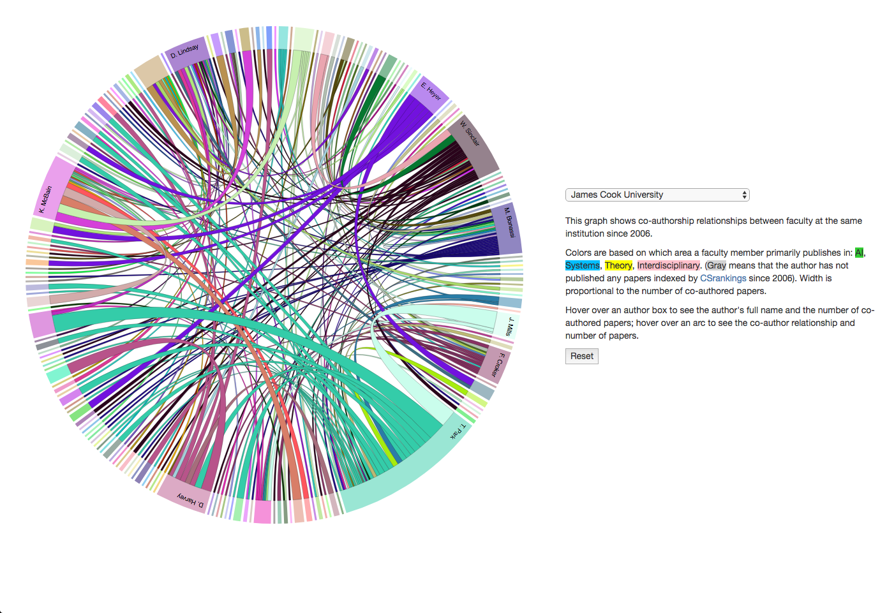

# README

Attempting to recreate [http://csrankings.org/collab/](http://csrankings.org/collab/) with JCU researcher data



## Explanation

* `collab/` contains the graph page from `csrankings.org` to populate with JCU data.

* `data-preparation` contains the sample data from `input/` into the python munging code `dumber.py` to create a the `nodes.csv` and `matrix.json` expected by D3.js in `output`.

## Getting Started

```shell

# run the python code
cd data-preparation
python dumber.py

# serve up the site
cd ../collab
npm install -g serve # feel free to use a different HTTP server like
serve
```
Open [http://localhost:3000](http://localhost:3000) in your browser and get hacking.


## Limitations

The D3.js chord viz seems to hit visual limits at < 1000 publications.  Note `if counter > 500:` currently used to limit.

## TODO

- [x] Get complete dataset that matches structure of sample
    See: `data-preparation/input/collaboration_post_2011.xlsx`

- [ ] Filter in Excel/splice and map in python based on ORGU, YEAR, login (any other categories?) Then decide which to plot based on which return data under < 500 rows.

- [ ] Setup side by side layout aka Climas style with input selectors based on the output of splicing 

## Notes

### Filtering

* Instead of selecting on name which is what appears on the document - use the Login as is consistent

* Duplicates exist in raw data source so when filtering use a count of 2000 as the mapping might remove double or triple that.

### Data Caveats

* Some input error in the original data, contact us, may be mis assignments.

* Note the data reflects collorations of the primary author while at JCU (affliated with JCU on the paper, e.g. not an external author)
